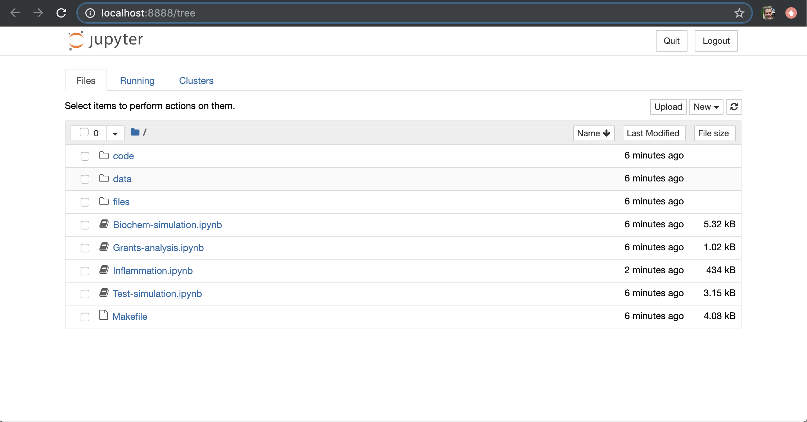
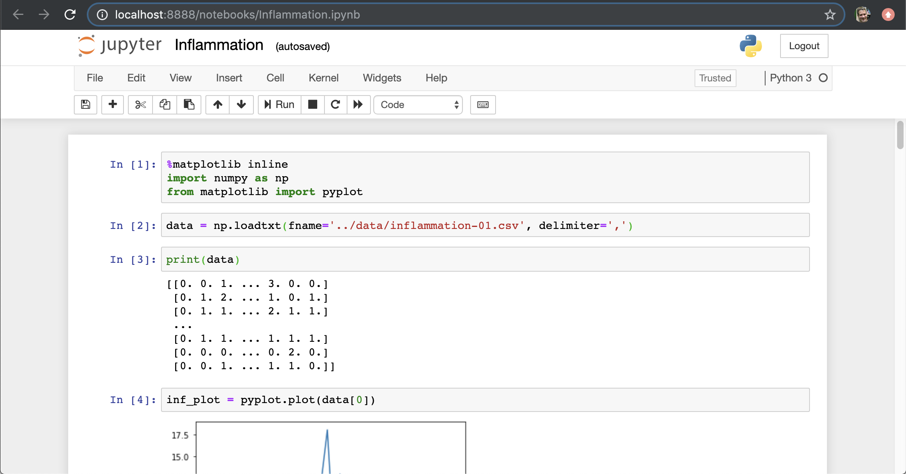

% Integrated Development Environment: Jupyter Notebook
% SSI

## What is a Jupyter Notebook?

- An *Integrated Development Environment*, or IDE
- Like the interpreter, but previous commands are interactive
- Can edit previous commands, output is recalculated
- Can mix code with discussion, commentary, and results (e.g. text output, graphs)

## Why use Notebooks?

- Support for many languages, e.g. Python, Java, R, Julia, Fortran
- Many helpful features, e.g. autocompletion
- Can save notebooks as a reproducible process to generate output
- Exploratory data analyses and visualisation
- Export formats, e.g. Python, PDF, LaTeX, ...
- Excellent for research, demonstration, teaching
- A good compromise between interpreter and full IDE like PyCharm

## How can you use Notebooks?

For creating and editing notebooks:

- Interactive notebooks are hosted by a server and provided via a web browser
- Temporary notebooks hosted via JupyterHub, e.g. jupyter.org
- Install and use Jupyter locally

For viewing notebooks statically:

- Using nbviewer at nbviewer.jupyter.org
- GitHub renders notebooks stored in its repositories

## The Jupyter Notebook Server

## An Example Notebook

